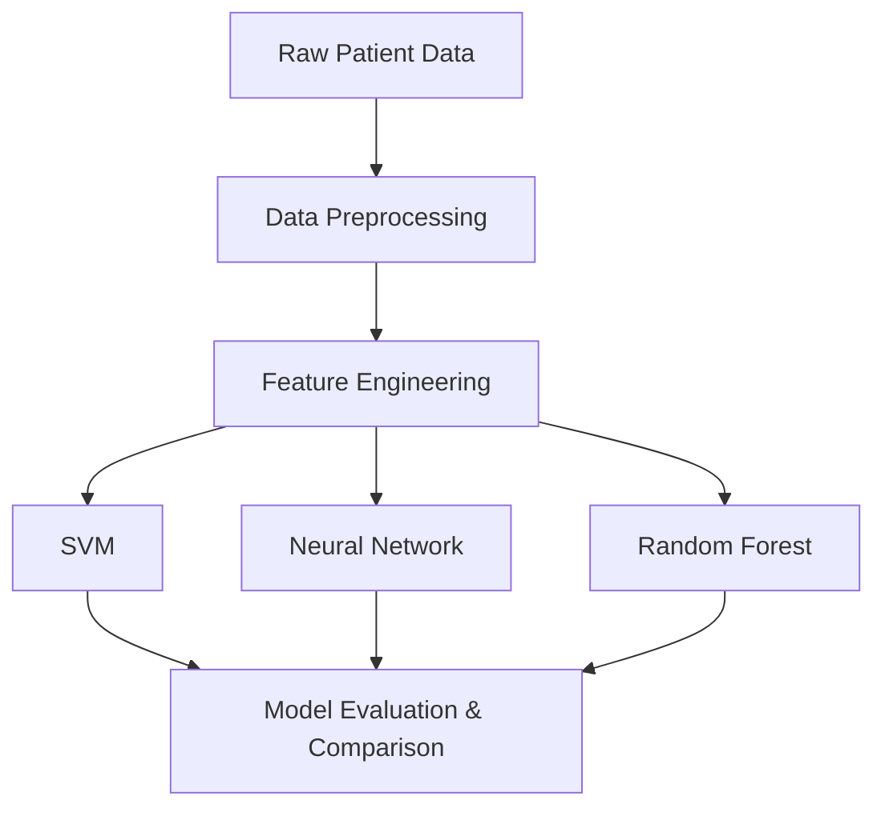

# Classifying Diabetes

## Overview
A comprehensive machine learning project evaluating multiple models (SVM, Neural Networks, Decision Trees, Logistic Regression, Random Forests) for diabetes prediction. This project highlights a strong data mining workflow, from exploratory data analysis to model evaluation and tuning.

## Architecture / Tech Stack
- **Models**: SVM, Neural Networks, Decision Trees, Random Forest, Logistic Regression
- **Data Stack**: Pandas, NumPy
- **ML Frameworks**: scikit-learn, TensorFlow/Keras
- **Environment**: Jupyter Notebooks



## Local Setup Instructions
```bash
git clone https://github.com/PatVraj/Classifying-Diabetes.git
cd Classifying-Diabetes
python -m venv .venv
source .venv/bin/activate
pip install pandas numpy scikit-learn tensorflow jupyter
jupyter notebook
```

## Key Results / Metrics
- Compared various architectures to find the optimal trade-off between recall and precision for medical diagnoses.
- Handled class imbalances effectively, showcasing robust data mining methodologies.

## Data Provenance & Licensing
- Dataset based on BRFSS (Behavioral Risk Factor Surveillance System) tabular data.

## Collaborators
- Vraj Patel
